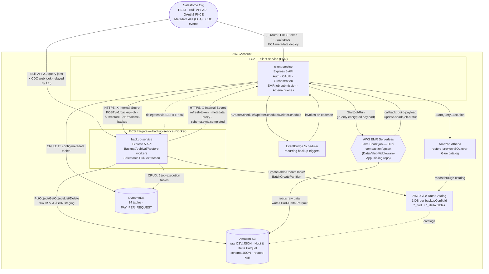
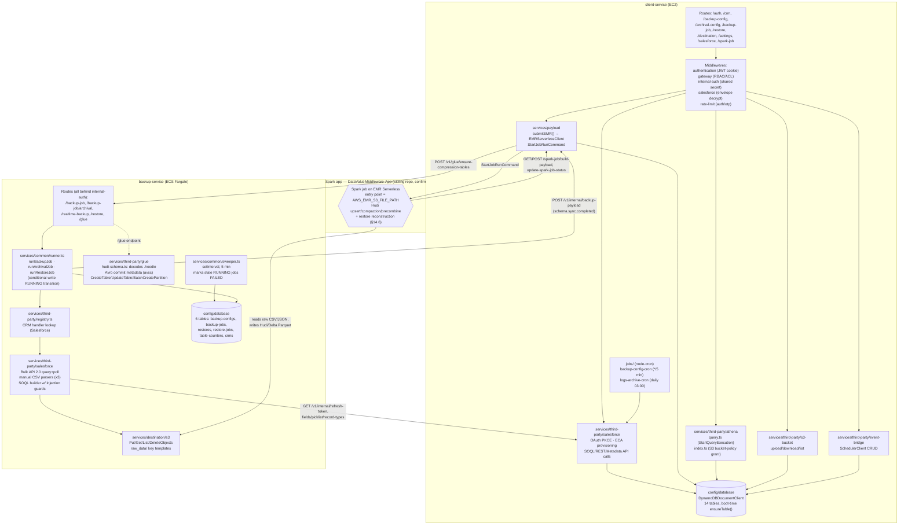
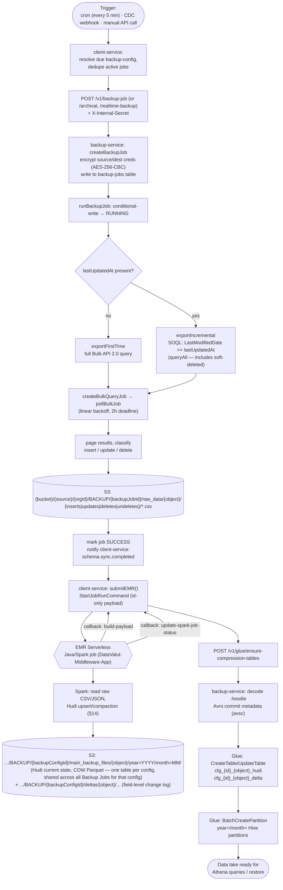
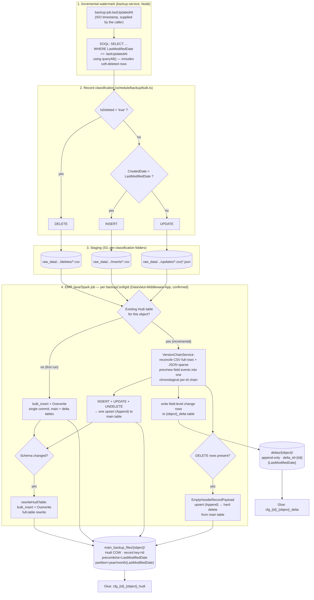
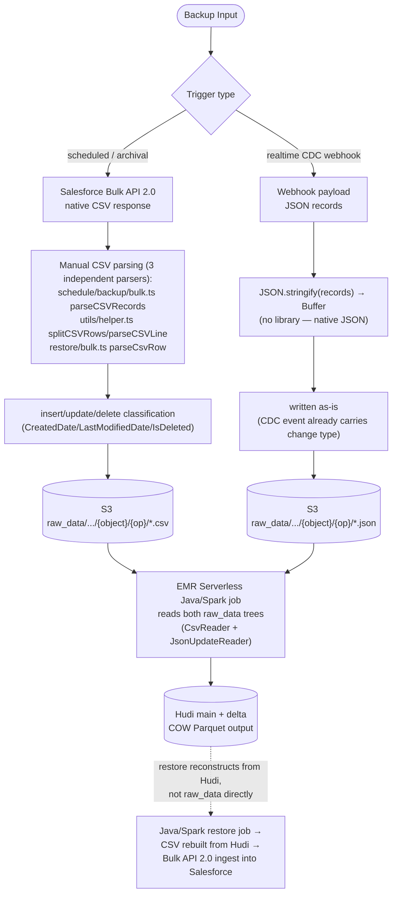
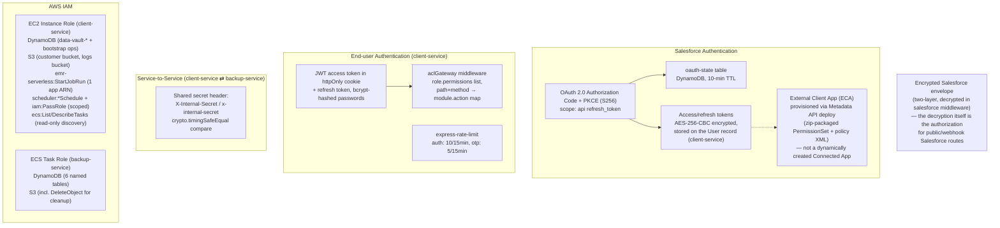
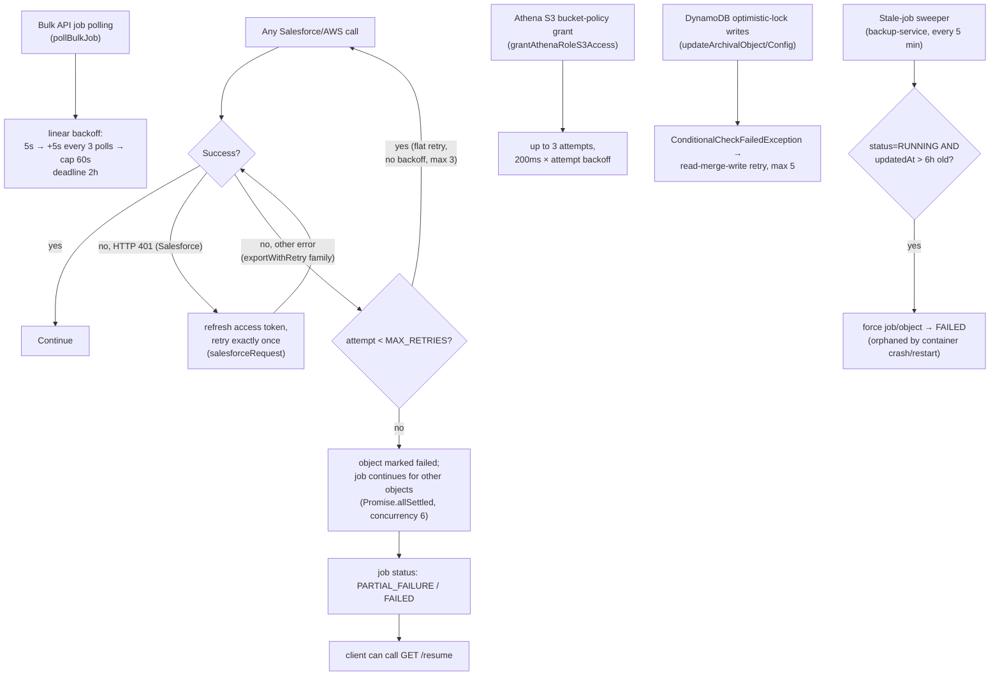
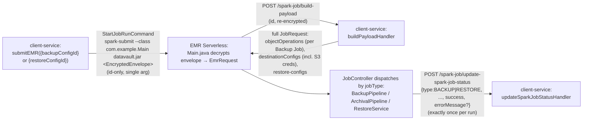

# DataVault Platform — System Architecture

> Source of truth generated by direct codebase inspection of `client-service`, `backup-service` (this repo, `feat/restore` branch), and `DataValut-Middleware-App` (sibling repo — the Java/Spark job that runs on EMR Serverless; see [§14](#14-emr-javaspark-service--confirmed-internals-datavalut-middleware-app)). Every claim below is traced to a specific file or line, cited inline — nothing here is invented from "common AWS architecture" assumptions.

## Contents

1. [Executive Summary](#1-executive-summary)
2. [Diagram 1 — Executive Architecture](#2-diagram-1--executive-architecture)
3. [Diagram 2 — Detailed Service Architecture](#3-diagram-2--detailed-service-architecture)
4. [Diagram 3 — Backup Data Flow](#4-diagram-3--backup-data-flow)
5. [Diagram 4 — Update / Delta Architecture](#5-diagram-4--update--delta-architecture)
6. [CSV vs JSON Processing](#6-csv-vs-json-processing)
7. [Diagram 5 — Security & Connectivity](#7-diagram-5--security--connectivity)
8. [Infrastructure Boundaries](#8-infrastructure-boundaries)
9. [Failure & Retry Paths](#9-failure--retry-paths)
10. [Service Responsibility Matrix](#10-service-responsibility-matrix)
11. [Request / Data-Flow Walkthroughs](#11-request--data-flow-walkthroughs)
12. [Why Each Technology Is Used](#12-why-each-technology-is-used)
13. [Confirmed Facts — Summary](#13-confirmed-facts--summary)
14. [EMR Java/Spark Service — Confirmed Internals (`DataValut-Middleware-App`)](#14-emr-javaspark-service--confirmed-internals-datavalut-middleware-app)

---

## 1. Executive Summary

DataVault is a two-service Node.js/TypeScript platform that backs up, archives, and restores Salesforce org data into a Hudi-based data lake on S3.

| # | Fact |
|---|------|
| 1 | Two runtime services exist: **client-service** (EC2, PM2) and **backup-service** (ECS Fargate, Docker). |
| 2 | client-service is the **API/orchestration/auth layer** — Salesforce OAuth, RBAC, config/metadata CRUD, EMR Serverless job submission, Athena restore-preview queries. |
| 3 | backup-service is the **data-movement worker** — Salesforce Bulk API extraction, raw CSV/JSON staging to S3, Glue Data Catalog registration, restore ingestion back into Salesforce. |
| 4 | Salesforce connects via **OAuth 2.0 with PKCE**, plus a pre-packaged **External Client App (ECA)** provisioned through the Metadata API — not a dynamically-created Connected App. |
| 5 | The two services talk to each other over **HTTPS with a shared-secret header** (`X-Internal-Secret`, `timingSafeEqual` compare). |
| 6 | The Hudi write path is executed by a **Java/Spark job on AWS EMR Serverless** (`DataValut-Middleware-App`, sibling repo — confirmed by direct inspection, see [§14](#14-emr-javaspark-service--confirmed-internals-datavalut-middleware-app)): record key `Id`, precombine key `LastModifiedDate`, table type Copy-on-Write, Hudi 1.1.0 / Spark 4.0.2 on EMR release `emr-8.0`. |
| 7 | Storage of record/config state is **DynamoDB exclusively** (14 tables, `PAY_PER_REQUEST`) — there is no relational database. |
| 8 | Scheduling is `node-cron` (client-service) + `EventBridge Scheduler` (recurring backup triggers) + a lightweight interval sweeper (backup-service) for stale-job cleanup. |

---

## 2. Diagram 1 — Executive Architecture



**Why each connection exists** — see [§12](#12-why-each-technology-is-used) for the rationale behind each AWS service, and [§11](#11-request--data-flow-walkthroughs) for the full trigger→result trace of each arrow above.

---

## 3. Diagram 2 — Detailed Service Architecture



**Notable internal detail confirmed in code:** client-service's `services/spark-job/index.ts` does **not** submit the EMR job itself — that happens in `services/payload/index.ts` (`submitEMR`). `spark-job/index.ts` is instead an HTTP client that calls backup-service's `/v1/glue/ensure-compression-tables` after Spark reports success — worth knowing when navigating the codebase. For the internal structure of the EMR Java/Spark app itself, see [§14](#14-emr-javaspark-service--confirmed-internals-datavalut-middleware-app).

---

## 4. Diagram 3 — Backup Data Flow



### Format-per-object clarification

* **Scheduled/archival backups** query Salesforce **Bulk API 2.0** which natively returns **CSV** — no Node-side conversion needed, only manual CSV parsing for classification.
* **Real-time (CDC webhook) backups** write **JSON** directly (`Buffer.from(JSON.stringify(records))`) — confirmed in `services/third-party/salesforce/realtime/index.ts`.
* **Restore** is a two-stage pipeline confirmed across both this repo and `DataValut-Middleware-App` (see [§11.D](#d-restore) and [§14.6](#146-restore-reads-hudi-not-raw-csv)): client-service submits an EMR job keyed by `restoreConfigId`; the Java/Spark app reconstructs the requested records **from the Hudi main + delta tables** and writes a fresh CSV to `restore/{restoreConfigId}/csv/{object}/restore.csv`; backup-service then streams that generated CSV for the Bulk API ingest into Salesforce.

---

## 5. Diagram 4 — Update / Delta Architecture

"Delta" in this system means two related things, both traced to source:

1. **Application-level delta (incremental sync window)** — a plain SOQL date filter computed by backup-service per job.
2. **Hudi "delta" table** — a field-level change-log Hudi table (`{object}_delta`) maintained by the EMR Java/Spark job, record-keyed on `delta_id = "{Id}|{LastModifiedDate}"` (or `"{Id}|DELETE|{time}"` for deletes) — confirmed in `DeltaService.java` and `VersionChainService.java`. This is separate from the "current state" Hudi table (`main_backup_files/`).



**UNDELETE** is folded into the same `upsert` as INSERT/UPDATE — it's a classification VersionChainService's chronological reconciliation produces, not a distinct Hudi write path.

**Why global-bloom + mutable-partition-path indexing on the main table:** its partition key (`LastModifiedDate`) changes on every update, so a plain per-partition Bloom index would leave a stale duplicate behind in the old partition. `GLOBAL_BLOOM` with `hoodie.bloom.index.update.partition.path=true` (`HudiUtils.java`) finds the record wherever it currently lives and relocates it. The delta table's key (`delta_id`) is immutable and append-only, so it uses a plain per-partition `BLOOM` index instead.

**Cascade delete** (REALTIME backups only — `CascadeDeleteService`): when a parent record is deleted and its schema declares a `childRelationship`, each relationship is either hard-deleted (same `EmptyHoodieRecordPayload` upsert path) or has its lookup field nullified via a normal upsert, per an `isCascadeDelete` flag on the relationship. Either outcome writes its own delta row (`change_type=CASCADE_DELETE` or `NULLIFY_LOOKUP`), using a delta schema distinct from `DeltaService`'s.

**Archival flow** (`runArchivalJob` in backup-service + `ArchivalPipeline`/`ArchivalService` in the Java app) is a related but distinct workflow: (1) on the Node side, Phase 1 backs up matching records, Phase 2 **hard-deletes** those same records from the live Salesforce org via a Bulk API delete job — an org-side purge; (2) on the Java side, archival is simpler — only inserts + schema-change operations, `bulk_insert+Overwrite` on first run and plain `upsert+Append` (deduped on Id/LastModifiedDate) thereafter, partitioned by `year/month` from `CreatedDate` rather than `LastModifiedDate`, under a separate `archival_` table prefix.

---

## 6. CSV vs JSON Processing



They **converge** at the EMR Serverless Java/Spark job (`DataValut-Middleware-App`, confirmed — [§14.5](#145-csv-vs-json-input-confirmed-java-side)), which reads both `raw_data` trees directly. JSON updates are not unioned with CSV rows as-is: they carry a sparse `{Id, LastModifiedDate, prev:{}, new:{}}` shape (only changed fields; explicit-null vs. absent-key is distinguished via an explicit `map<string,string>` Spark schema) and are reconciled against existing Hudi state by `VersionChainService` before being merged into the main-table upsert. Restore, once triggered, reads the already-reconciled **Hudi** tables — see [§11.D](#d-restore).

---

## 7. Diagram 5 — Security & Connectivity



* **Salesforce OAuth**: PKCE-based authorization-code flow; state + code verifier persisted in DynamoDB with a 10-minute TTL. Tokens are AES-256-CBC encrypted before being persisted.
* **ECA provisioning**: instead of creating a new Salesforce Connected App per org, the platform deploys a `PermissionSet` and `ExtlClntAppOauthConfigurablePolicies` metadata against a pre-packaged External Client App via the SOAP Metadata API, then assigns the admin user through a custom Apex REST callout.
* **Inter-service auth**: a shared-secret header compared with `crypto.timingSafeEqual` — symmetric (both services send and check the same header), gating `/internal/*` and all of backup-service's `/v1/*` routes.
* **IAM**: two distinct roles (EC2 instance role, ECS task role), each scoped to the specific AWS actions that service calls — DynamoDB tables it owns, its S3 buckets, `emr-serverless:StartJobRun` against one application ARN, and scoped scheduler/ECS-discovery actions.

---

## 8. Infrastructure Boundaries

| Boundary | Status |
|---|---|
| Salesforce org (external system) | Confirmed |
| AWS Account | Confirmed (region `us-east-2` for ECR/ECS; client-service default region `ap-south-1` per `constant/index.ts`) |
| EC2 (client-service host) | Confirmed |
| ECS Fargate (backup-service) | Confirmed — `awsvpc` networking, task has its own public IP |
| S3, Glue, EMR Serverless, DynamoDB, EventBridge Scheduler, Athena | Confirmed via SDK client instantiation in source |

---

## 9. Failure & Retry Paths



Glue writes rely on catching `AlreadyExistsException` for idempotency, alongside the AWS SDK's own default retry behavior.

---

## 10. Service Responsibility Matrix

| Component | Deployment | Responsibility | Why Used | Communicates With |
|---|---|---|---|---|
| Salesforce | External | System of record for CRM data | Source system being backed up | client-service (OAuth/metadata), backup-service (Bulk API/CDC) |
| client-service | EC2 (PM2, behind nginx) | Auth, RBAC, Salesforce OAuth/ECA provisioning, config/metadata CRUD, EMR Serverless job submission, Athena restore-preview, scheduling | Long-lived stateful process suits PM2/EC2; owns the DynamoDB schema bootstrap at boot | Salesforce, backup-service, DynamoDB, S3, Athena, EMR Serverless, EventBridge Scheduler |
| backup-service | ECS Fargate (Docker) | Backup/archival/restore job execution, Salesforce Bulk API extraction, raw CSV/JSON staging, Glue catalog registration | Stateless, horizontally-scalable worker workload — a natural fit for container orchestration, isolated from the API/auth surface | Salesforce, client-service, DynamoDB, S3, Glue |
| DynamoDB | AWS (regional) | Config, job, session, and metadata storage — 14 tables | Serverless key-value store matching the access patterns (lookup by ID + a handful of GSIs); `PAY_PER_REQUEST` avoids capacity planning | client-service (13 tables), backup-service (6 tables) |
| S3 | AWS (regional) | Object storage: raw CSV/JSON, Hudi/Delta Parquet, schema JSON, rotated logs | Durable, cheap, scalable — the natural substrate for a Hudi data lake and for staging bulk export files | backup-service (write raw), EMR Serverless Spark job (read raw, write Hudi/Delta), Glue (catalogs it), client-service (log archive) |
| AWS Glue | AWS (regional) | Data Catalog only — table/partition metadata for the Hudi/Delta datasets | Lets Athena (and any future query engine) discover schema/partitions without a separate metastore; no Glue ETL jobs are used | backup-service (writes catalog), Athena (reads catalog) |
| AWS EMR Serverless | AWS (regional) | Runs the Java/Spark job (`DataValut-Middleware-App`) that performs the actual Hudi upsert/compaction and restore reconstruction | Serverless Spark avoids managing a persistent EMR cluster for what is a bursty, job-triggered workload | client-service (submits job, receives callbacks), S3 (reads raw, writes Hudi) |
| EMR Java/Spark app (`DataValut-Middleware-App`) | AWS EMR Serverless (sibling repo) | Hudi table writes (backup + archival), field-level delta generation, schema evolution, cascade delete, restore reconstruction | Distributed compute for Copy-on-Write Hudi merges at Salesforce-org scale; kept out of both Node services since it's a different runtime (JVM/Spark) | client-service (`/spark-job/build-payload`, `/spark-job/update-spark-job-status`), S3, Glue (indirectly, via backup-service after callback) |
| Athena | AWS (regional) | Ad-hoc SQL over the Glue-cataloged Hudi/Delta tables, used for restore-preview | Serverless query engine — no need to stand up a database just to preview records before a restore | client-service, Glue Data Catalog |
| EventBridge Scheduler | AWS (regional) | Recurring invocation of scheduled (non-immediate) backup configs | Managed cron replacement that survives EC2 restarts, unlike an in-process `node-cron` schedule for long-interval jobs | client-service (creates/receives schedules) |

---

## 11. Request / Data-Flow Walkthroughs

**Trigger → Processing → Storage → Result**, for each of the four flows the code implements:

### A. Scheduled (cron-driven) full/incremental backup
1. **Trigger** — `jobs/backup-config-cron.ts` fires every 5 minutes in client-service, finds backup-configs due for a run, and skips any with an already-active job.
2. **Processing** — client-service calls `POST /v1/backup-job` on backup-service, which runs `exportFirstTime` or `exportIncremental` against Salesforce Bulk API 2.0 and classifies each returned row as insert/update/delete.
3. **Storage** — classified CSV pages land in S3 under `raw_data/{backupJobId}/{object}/{op}/`.
4. **Result** — once complete, client-service submits an EMR Serverless Spark job that turns the raw CSV into Hudi/Delta Parquet, and backup-service registers the result in Glue.

### B. Real-time (Salesforce CDC webhook) backup
1. **Trigger** — Salesforce fires a webhook that client-service's `attachDecryptedSalesforceRequest` middleware decrypts and validates.
2. **Processing** — `processRealtimeWebhook` fans out one `POST /v1/realtime-backup` call per matching REALTIME-schedule backup-config to backup-service.
3. **Storage** — backup-service writes the CDC payload directly as JSON to `raw_data/{backupJobId}/{object}/{op}/*.json` — no Bulk API round-trip.
4. **Result** — same downstream Spark/Glue path as the scheduled flow. Because the Hudi tables are built from both CSV and JSON sources, this data is fully available the next time a restore reads Hudi (see [§6](#6-csv-vs-json-processing)).

### C. Archival backup (backup-then-purge)
1. **Trigger** — same as scheduled, via `/v1/backup-job/archival`.
2. **Processing** — Phase 1 exports matching records exactly like a normal backup; Phase 2 issues a Salesforce Bulk API **delete** job against the same record set.
3. **Storage** — export lands in S3 identically to a normal backup; deletion failures are logged to `error_logs/{backupJobId}/{object}/{objectId}`.
4. **Result** — the org's live data is purged while the archived copy is retained in the data lake.

### D. Restore
1. **Trigger** — user selects records via client-service's Athena-backed restore-preview UI, then `POST /v1/restore-retrieve` (or `/activate` for a DRAFT), which calls `createRestoreJob` then `initalizeRestoreTransform(restoreJobId)`.
2. **EMR/Hudi reconstruction** — `initalizeRestoreTransform` submits an EMR job keyed by `restoreConfigId` (`services/payload/index.ts` → `submitEMR`). The Java/Spark app (`DataValut-Middleware-App`) fetches the full restore config from `/spark-job/build-payload`, compresses any un-merged backup data for the source object into Hudi, then reads the **Hudi main + delta tables** and reconstructs the requested record set per `RestoreConfigs.SourceType` (`ENTIRE`, `PARTIAL`/delta-reconstructed, `CHANGED_BETWEEN` a date window, or `DELETED_ONLY`), applying parent resurrection, inactive-owner reassignment, record-type mapping, and merge-conflict rules along the way.
3. **Handoff** — the Java app writes the reconstructed rows to `restore/{restoreConfigId}/csv/{object}/restore.csv` in S3, then calls back `POST /spark-job/update-spark-job-status`. client-service's handler calls `tiggerRestoreJob`, which `POST`s to backup-service's `/v1/restore`.
4. **Ingest & result** — backup-service streams that Spark-generated CSV (`streamCsvLinesFromS3`) and re-uploads it through a Salesforce Bulk API 2.0 ingest job (insert/update). Failed rows surface via `getFailedResults`; the restore job's status reflects partial vs. full success.

Restore is **Hudi-sourced end-to-end**: the CSV backup-service reads is generated fresh by the Java/Spark job from the Hudi tables for that specific restore request, so it reflects every source — bulk, archival, and realtime/CDC alike. See [§14.6](#146-restore-reads-hudi-not-raw-csv) for the full cross-repo trace.

---

## 12. Why Each Technology Is Used

* **Salesforce** — the system of record. All backup/restore semantics exist to protect and reproduce data that lives here; connectivity is OAuth2/PKCE + REST + Bulk API 2.0 for volume, plus CDC webhooks for near-real-time capture.
* **EC2 / client-service** — hosts the long-lived, stateful API/auth/orchestration surface (JWT sessions, DynamoDB table bootstrap at process start, cron scheduling) — a persistent-process deployment model (PM2) fits this better than a stateless container fleet.
* **ECS / backup-service** — isolates the data-movement workload (Bulk API extraction, S3 staging) from the API/auth surface so it can be redeployed and scaled independently without touching client-service; containerization also matches its stateless, horizontally-scalable job-execution nature.
* **S3** — durable, scalable object storage for every stage of the pipeline: raw CSV/JSON exports, the Hudi current-state table, the Hudi Delta (change-log) table, versioned schema JSON, and archived application logs.
* **AWS Glue** — used exclusively as a **Data Catalog** (no ETL jobs): one database per `backupConfigId`, two tables per Salesforce object (`_hudi`, `_delta`), with Hive-style `year=/month=` partitions registered via `BatchCreatePartition`. This lets Athena discover schema/partitions without a hand-maintained metastore.
* **EMR Serverless** — runs the Spark job that performs the actual Hudi write (compaction/upsert). Serverless was chosen over a persistent EMR cluster because the workload is bursty and job-triggered (one run per compression cycle), not continuous.
* **Hudi** — provides record-level upsert/delete semantics and a timeline of changes for the data lake. Confirmed configuration (`DataValut-Middleware-App`, `HudiUtils.java`): record key `Id`, precombine key `LastModifiedDate`, table type **Copy-on-Write** (chosen for simple, merge-free reads since this data is read-heavy via Athena/restore), partitioned by `year/month` derived from `LastModifiedDate` (main table) or `CreatedDate` (archival), `GLOBAL_BLOOM` index with mutable-partition-path relocation, ZSTD compression, and inline clustering every 5 commits. A separate append-only Delta table per object (`{object}_delta`) tracks field-level changes for reconstruction (used by restore) rather than duplicating full rows.
* **Athena** — a serverless SQL engine over the Glue-cataloged Hudi tables, used specifically to preview records before committing to a restore, avoiding the need to stand up a dedicated query database.
* **DynamoDB** — the sole operational datastore for both services (14 tables total): configs, jobs, sessions, users, roles, OAuth state, counters. `PAY_PER_REQUEST` billing avoids capacity planning for what is a moderate, spiky traffic pattern.
* **EventBridge Scheduler** — provides durable, managed recurring triggers for scheduled backup-configs, chosen (per the client-service SDK dependency `@aws-sdk/client-scheduler`) over raw EventBridge rules or an in-process cron for jobs that must survive EC2 restarts and fire independent of the app process's uptime.

---

## 13. Confirmed Facts — Summary

| Claim | Status |
|---|---|
| client-service on EC2, backup-service on ECS Fargate | Confirmed (GitHub Actions workflows) |
| Inter-service auth = shared-secret header | Confirmed (`middlewares/internal-auth`) |
| EMR **Serverless**, not a classic EMR cluster | Confirmed (`@aws-sdk/client-emr-serverless`, `StartJobRunCommand`) |
| Hudi write/merge logic (record key, precombine, table type, per-operation write mode) | Confirmed — traced to `DataValut-Middleware-App` (sibling repo), a Java/Spark app; see [§14](#14-emr-javaspark-service--confirmed-internals-datavalut-middleware-app) |
| Glue used only as Data Catalog, no Glue ETL jobs | Confirmed (only Create/Get/Update Table + BatchCreatePartition calls found) |
| Scheduling uses `@aws-sdk/client-scheduler` (EventBridge Scheduler) | Confirmed via grep |
| client-service submits EMR jobs for restore too, not just backup compression | Confirmed — `initalizeRestoreTransform` / `submitEMR({ restoreConfigId })` in `services/payload/index.ts`, called from `controller/v1/restore-retrieve/index.ts` |
| Restore reads the Hudi main/delta tables, so realtime (JSON/CDC) data is included | Confirmed — see [§14.6](#146-restore-reads-hudi-not-raw-csv) |
| Cascade delete (parent → child) on realtime backups | Confirmed — `CascadeDeleteService` in `DataValut-Middleware-App`, REALTIME-only |
| Pipeline stage checkpointing for crash recovery in the Spark job | Confirmed — `StageCheckpoint` in `DataValut-Middleware-App` |

---

## 14. EMR Java/Spark Service — Confirmed Internals (`DataValut-Middleware-App`)

**Scope note:** everything in this section is sourced from direct inspection of the sibling repository `DataValut-Middleware-App/src` (Java, Spark, package `com.example.*`). This is the code client-service's `submitEMR()` triggers via `StartJobRunCommand`.

### 14.1 Job intake & credential flow



* The EMR step's only argument is a Base64-encrypted envelope carrying exactly one of `backupConfigId` or `restoreConfigId` (`Main.java`, `EmrRequest.java`) — an id-only payload.
* Backup Job IDs are **not** in that argument — they arrive as the keys of `objectOperations` in the `/build-payload` response.
* AWS credentials for the Spark session (S3 key/secret/region/bucket) are delivered per-job inside that same payload (`destinationConfigs.destinationRequiredCreds`), not baked into the EMR application itself.

### 14.2 Schema evolution

Schema comparison/versioning is handled by `SchemaComparator`, `SchemaDeltaService`, `SchemaService`, `DataFrameCaster`, and `SchemaCatalog`/`SchemaIO`. A detected schema change (field added/dropped/retyped) triggers `rewriteHudiTable` — a full-table `bulk_insert + Overwrite` — and produces its own schema-change delta rows (`SchemaDeltaService`, one row per changed field element, not per affected record). This is the same rewrite path referenced in [§5](#5-diagram-4--update--delta-architecture)'s "Schema changed?" branch.

### 14.3 S3 path layout (`FolderStructureResolver` / `PathUtils`)

```
{bucket}/{sourceName}/{orgId}/BACKUP/{backupJobId}/raw_data/{object}/{inserts|updates|deletes|undeletes}/   ← input, per Backup Job
{bucket}/{sourceName}/{orgId}/BACKUP/{configId}/main_backup_files/{object}/                                  ← Hudi main (flat root; year=/month= partitions inside)
{bucket}/{sourceName}/{orgId}/BACKUP/{configId}/deltas/{object}/                                             ← Hudi delta (flat)
{bucket}/{sourceName}/{orgId}/BACKUP/{configId}/schemas/{object}/                                            ← schema parquet (not Hudi)
{bucket}/{sourceName}/{orgId}/archival/{jobId}/main_archival_files/{object}/                                 ← archival Hudi
{bucket}/{sourceName}/{orgId}/restore/{restoreConfigId}/csv/{object}/restore.csv                             ← restore output CSV
```

Structural detail worth knowing: **backup Hudi output is scoped by `backupConfigId`, not `backupJobId`** — multiple Backup Jobs (each with its own `raw_data/` tree) feed into one shared per-config Hudi table.

### 14.4 Retry & checkpointing

`RetryExecutor` + `RetryPolicy` define typed backoff policies, each scoped to retry `TRANSIENT`/`INFRASTRUCTURE` failures (via `ErrorClassifier`):

| Policy | Attempts | Backoff |
|---|---|---|
| `HUDI_WRITE` | 3 | 2s, ×2, cap 30s |
| `S3_READ` | 4 | 1s, ×2, cap 15s |
| `NODE_API` | 4 | 1s, ×2, cap 15s |
| `OBJECT_PIPELINE` | 2 | fixed 5s |
| `NO_RETRY` | — | — |

`StageCheckpoint` persists which pipeline stage last completed (e.g. `FIRST_RUN_MAIN_WRITE`, `DELTA_WRITE`, `SCHEMA_REWRITE`, `MAIN_UPSERT`, `HARD_DELETE`) so a retried job resumes rather than re-executing already-committed Hudi writes.

### 14.5 CSV vs JSON input (confirmed, Java side)

`CsvReader` reads `raw_data/{inserts,updates,deletes,undeletes}` as all-String columns, sanitizes dot-containing column names for Hudi/Parquet compatibility, and dedupes by `(Id, LastModifiedDate)`. `JsonUpdateReader` reads the `updates/` folder's `{Id, LastModifiedDate, prev:{}, new:{}}` shape via an explicit `map<string,string>` Spark schema (so "absent key" is distinguishable from "null value"). Both feed `VersionChainService`, which unifies CSV full-row updates and JSON sparse field-level events into one chronological per-Id change chain (forward-fill via `last(ignoreNulls=true)` + `lag()`), producing both the delta rows and the final accumulated row used for the main-table upsert.

### 14.6 Restore reads Hudi, not raw CSV

`RestoreService.java` is a full pipeline dispatched by the Java app (`JobController`, jobType `RESTORE`):

* Restore first compresses any un-merged backup data for the source object into Hudi (invoking `BackupService.run` inline), so Hudi always reflects the latest state before reconstruction begins.
* It then reads the **Hudi main + delta tables** for each object — `spark.read().format("hudi").load(mainHudiPath)`.
* `RestoreConfigs.SourceType` supports `ENTIRE` (current Hudi snapshot as-is), `PARTIAL`/default (reconstruct via delta), `CHANGED_BETWEEN` (undo deltas within a date window using `change_time`), and `DELETED_ONLY`.
* Handles missing/mandatory parent resurrection from DELETE deltas (one level), inactive-owner reassignment, record-type mapping, required-field defaults, and merge rules (source-wins vs. destination-wins), plus field renaming.
* Writes CSV per object to `restore/{restoreConfigId}/csv/{object}/restore.csv`; `isDemoOnly=true` runs the full reconstruction but writes nothing (dry-run record-count preview).

Because Hudi is built from **both** the CSV and JSON raw trees ([§14.5](#145-csv-vs-json-input-confirmed-java-side)), realtime-originated (JSON/CDC) data is included in every restore. The full, confirmed restore chain spans all three repos:

**client-service** (`initalizeRestoreTransform` → EMR) → **Java/Spark app** (Hudi main+delta → reconstructed `restore.csv` in S3) → **client-service** (`/update-spark-job-status` → `tiggerRestoreJob`) → **backup-service** (`streamCsvLinesFromS3` → Salesforce Bulk API 2.0 ingest).

### 14.7 Library versions & write-config defaults

Hudi **1.1.0**, Spark **4.0.2**, Scala **2.13**, via the EMR Serverless native bundle for release **`emr-8.0`** (`pom.xml`). `hoodie.write.table.version` is pinned to **6** for Athena's Hudi connector compatibility (`HudiUtils.java`). Cleaner policy `KEEP_LATEST_FILE_VERSIONS` (retain 1, synchronous), ZSTD compression, 256MB target file size, inline clustering every 5 commits.

---

