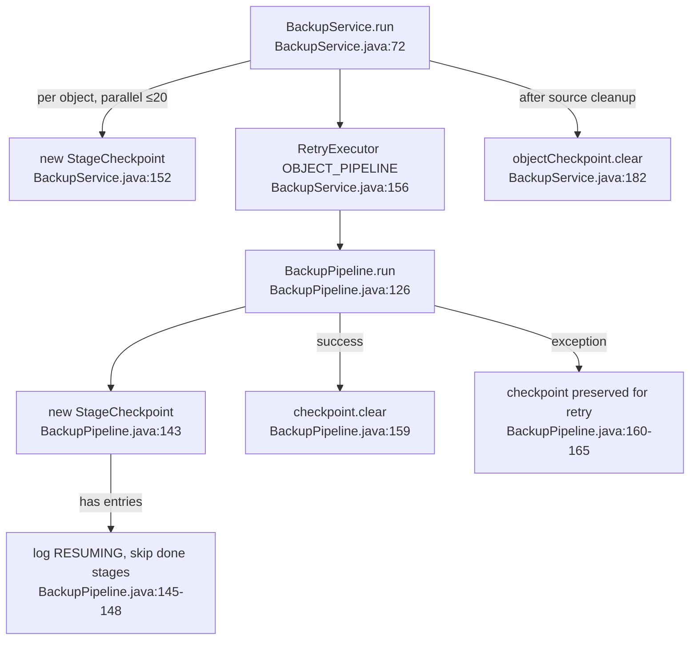
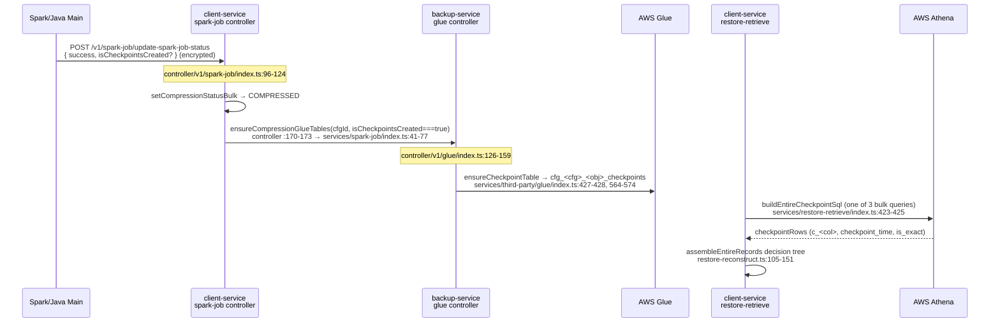

---
tags:
  - architecture
  - execution
  - checkpoint
  - spark
  - java
  - restore
---

# Execution Flow: Checkpoint (Spark / Java middleware)

Written 2026-07-23 from the Java source in
`DataValut-Middleware-App/src/main/java/com/example/` (sibling repo of this one)
and its Node consumers in `client-service` / `backup-service`.
Every claim below carries a `file:line` pointer — future sessions can jump
straight to the code.

> Path convention in this doc:
> `JAVA = C:\Users\hp\OneDrive\Documents\GitHub\DataValut-Middleware-App\src\main\java\com\example`
> `NODE = C:\Users\hp\OneDrive\Documents\GitHub\data-vault-service`

**There are TWO unrelated things called "checkpoint" in the Java code.** Do not
confuse them:

| # | Mechanism | Class | Granularity | Storage | Consumer |
|---|-----------|-------|-------------|---------|----------|
| A | **StageCheckpoint** — crash-resume | `JAVA\retry\StageCheckpoint.java` | Pipeline stage, per object, per run | Plain-text file `.pipeline_checkpoint` on S3 | The next retry of the same run (Java only) |
| B | **CheckpointService** — periodic snapshot | `JAVA\backup\service\CheckpointService.java` | Full main-table snapshot every 20 delta versions | Hudi table `checkpoints/{object}/` | RESTORE via Athena (Node, never Java) |

---

## A. StageCheckpoint — stage-level crash-resume

### Purpose
If the Spark driver dies after writing the delta table but before the main
upsert, the retry must not write deltas twice. A tiny text file records which
durable (Hudi-writing) stages already completed; the retry skips them.
Class javadoc: `StageCheckpoint.java:20-59`.

### File format & location
- One stage name per line; append-only during a run (`StageCheckpoint.java:29-37`).
- Path: `{scopedBase}/raw_data/{object}/.pipeline_checkpoint` (`StageCheckpoint.java:115`),
  deliberately inside `raw_data/` so successful-run cleanup removes it as a side
  effect (`StageCheckpoint.java:39-44`).
- `scopedBase` = `{bucket}/{sourceName}/{orgId}/backup/{jobId}` — built by
  `PathUtils.buildScopedBaseUri` (`JAVA\util\PathUtils.java:149-152`).

### The 8 checkpointed stages (`StageCheckpoint.java:72-97`)
Only stages with durable side effects are checkpointed; in-memory transforms are
cheap to re-run (`StageCheckpoint.java:66-71`).

| Stage | Marked done at | Guarded (skip-if-done) at |
|-------|----------------|---------------------------|
| `DELTA_WRITE` | `BackupPipeline.java:389` | `BackupPipeline.java:373` |
| `SCHEMA_REWRITE` | `BackupPipeline.java:428` | `BackupPipeline.java:405` |
| `MAIN_UPSERT` | `BackupPipeline.java:513` | `BackupPipeline.java:484` |
| `HARD_DELETE` | `BackupPipeline.java:529` | `BackupPipeline.java:523` |
| `FIRST_RUN_MAIN_WRITE` | `BackupPipeline.java:215` | `BackupPipeline.java:209` |
| `FIRST_RUN_DELTA_WRITE` | `BackupPipeline.java:216` | `BackupPipeline.java:209` |
| `FIRST_RUN_CLEANUP` | `BackupPipeline.java:226` | `BackupPipeline.java:224` |
| `SOURCE_CLEANUP` | (see note) | `BackupService.java:169` |

Note: `SOURCE_CLEANUP` is checked in `BackupService` before calling
`SourceCleaner.deleteSourceFiles` (`JAVA\backup\service\BackupService.java:169-181`);
`SourceCleaner`'s javadoc documents the contract (`JAVA\util\SourceCleaner.java:29-33`).

### API (all in `StageCheckpoint.java`)
- Constructor `:113-117` — reads any existing file immediately (`loadFromDisk` `:216-257`), so `isDone()` reflects a previous failed run. Unknown stage names in the file are ignored with a WARN (`:237-241`).
- `isDone(stage)` `:123-125` — in-memory set lookup.
- `markDone(stage)` `:135-171` — **overwrites** the file with the full completed set (append unsupported on local FS used in tests, `:148-150`). Write failure is **non-fatal** (WARN): worst case a re-run re-executes a stage, safe because all Hudi writes are idempotent upserts (`:162-170`).
- `clear()` `:184-198` — deletes the file after a fully successful run. Delete failure is WARN-only; the javadoc documents the stale-checkpoint risk (`:173-183`).
- `getCompletedStages()` `:205-207` — used for the "RESUMING from checkpoint" log.

### Lifecycle wiring

Nodes: [[COMPRESSION]] (the run this happens inside), [[STALE_JOB_SWEEP]] (what
recovers a stranded run), [[BUSINESS_RULES]].

Two `StageCheckpoint` instances exist per object per run (one in
`BackupService`, one in `BackupPipeline`) — same S3 file, so they see the same
state; not thread-safe by design, one object = one instance per layer
(`StageCheckpoint.java:50-52`).

### Failure semantics (the invariants)
1. Checkpoint write failure never aborts the pipeline (`StageCheckpoint.java:162-170`).
2. Pipeline failure preserves the file (`BackupPipeline.java:160-165`) — the
   catch rethrows *after* logging completed stages.
3. `RetryPolicy.OBJECT_PIPELINE` retries the whole pipeline in-process
   (`BackupService.java:156-160`); the resume is driven by the *same* file
   whether the retry is in-process or a whole new EMR run.
4. Stale-file hazard: if `clear()` fails, the *next* job run would skip stages.
   Mitigation is documented as a required caller behaviour in
   `StageCheckpoint.java:173-183` — treat as a known ceiling.

---

## B. CheckpointService — periodic full-snapshot Hudi table

### Purpose
Every 20 delta versions, snapshot the main Hudi table's **pre-update** state
into `checkpoints/{object}/` so RESTORE can start from a recent baseline instead
of replaying the whole delta history. The delta table itself is never touched.
Class javadoc: `CheckpointService.java:20-47`.

### Why a counter file instead of the Hudi timeline
`HudiUtils` sets `hoodie.keep.max.commits=5` (`JAVA\util\HudiUtils.java:179`) —
timeline instants are archived long before 20 accumulate, so counting `.commit`
files can never reach the threshold. A one-line counter file is O(1)
(`CheckpointService.java:25-32`).

### Paths (single source of truth)
- Checkpoint Hudi table: `{scopedBase}/checkpoints/{object}/` —
  `PathUtils.checkpointHudi` (`JAVA\util\PathUtils.java:244-250`), resolved via
  `FolderStructureResolver.DataCategory.CHECKPOINT_HUDI`
  (`JAVA\resolver\FolderStructureResolver.java:70-74,117`).
- Counter file: `{scopedBase}/checkpoints/{object}.delta_versions` —
  `PathUtils.checkpointVersionCounter` (`JAVA\util\PathUtils.java:252-261`).
  **Beside** the table folder, not inside it, so the `SaveMode.Overwrite`
  snapshot write can never wipe it (`PathUtils.java:256-257`).

### Counter lifecycle (`CheckpointService.java:33-41`)
```
maybeCheckpoint()        — BEFORE the delta write: count >= 20 → snapshot + reset to 0
incrementDeltaVersion()  — AFTER every successful delta Hudi commit: count+1
```
Call sites, in order, inside the incremental path of
`BackupPipeline.runIncremental`:
1. `maybeCheckpoint(...)` at `BackupPipeline.java:382` — passed the **cached
   pre-update snapshot** read at `BackupPipeline.java:300`
   (`readAndCacheSnapshot` `:557-576`), the resolved `CHECKPOINT_HUDI` path
   (`:377-379`), the counter path (`:380`), and table name
   `{tableName}_checkpoint` (`:383`).
2. Delta write via `deltaService.writeAllDeltas` under `RetryPolicy.HUDI_WRITE`
   (`:385-388`), then `checkpoint.markDone(DELTA_WRITE)` (`:389`).
3. `incrementDeltaVersion(...)` at `BackupPipeline.java:390`.

First runs never checkpoint: `maybeCheckpoint` is only reached in
`runIncremental`, and requires a non-null main snapshot
(`CheckpointService.java:90-94`).

### Snapshot write (`CheckpointService.java:96-129`)
- Drops Hudi meta columns, repartitions by the snapshot's existing
  `year`/`month` columns (`:98-100`) — identical partition logic to the main
  table (`:43-46`).
- Writes with `bulk_insert` + `SaveMode.Overwrite` (`:102-119`) → **only the
  latest checkpoint is kept**. `ponytail:` comment at `:111-114` documents the
  upgrade path (timestamped subfolders) if point-in-time checkpoints are ever
  needed. Full history stays recoverable: first-run backup + complete delta chain.
- On success: sets the static run flag (`:121`), resets counter to 0 (`:122`).
- On failure: counter NOT reset → self-heals by retrying next run (`:125-129`).
- All counter I/O is non-fatal; `readCount` treats absent/unreadable as 0
  (`:146-160`).

### Run-level flag → status report (the Java → Node handoff)
- `CHECKPOINT_CREATED_THIS_RUN` static `AtomicBoolean`
  (`CheckpointService.java:55-64`) — the `ponytail:` comment at `:55-57`
  explains why static: one JVM = one job run, threading it through four
  signatures buys nothing.
- Read by `Main.reportStatus` → `PayloadClient.reportStatus(...,
  anyCheckpointCreated())` (`JAVA\Main.java:173-187`, call at `:178`).
- `PayloadClient.reportStatus` (`JAVA\util\PayloadClient.java:130-151`) adds
  `"isCheckpointsCreated": true` to the encrypted status payload **only when
  `success && checkpointsCreated`** (`:140-142`). Payload shapes documented at
  `:114-120`.

---

## C. Cross-service consumer chain (Node — how checkpoints reach RESTORE)

Java never reads the checkpoint table back. Consumption is Athena-only, wired
through the [[COMPRESSION]] status round-trip:


Nodes: [[COMPRESSION]] · [[RESTORE_RECORD_RETRIEVAL]] · [[RESTORE_RETRIEVE]] ·
[[EXTERNAL_INTEGRATIONS]] · [[SECURITY]] (encrypted transport envelope).

Key facts per hop (all in `NODE`):
- `client-service/src/controller/v1/spark-job/index.ts:96-173` — decrypts
  `isCheckpointsCreated?`, passes `isCheckpointsCreated === true` into
  `ensureCompressionGlueTables` (`:170-173`). Glue ensure is best-effort — the
  COMPRESSED status is already committed.
- `client-service/src/services/spark-job/index.ts:41-77` — default `false`
  (`:43`), forwarded in the POST body (`:75`).
- `backup-service/src/controller/v1/glue/index.ts:126-159` — the checkpoints
  table is only ensured when the flag is true (`:157-159`); Hudi + delta tables
  are ensured unconditionally.
- `backup-service/src/services/third-party/glue/index.ts:564-574` —
  `ensureCheckpointTable` reuses `ensureHudiFormatTable` with
  `dataset: 'checkpoints'`; table name `cfg_<cfg>_<obj>_checkpoints` (`:427-428`),
  S3 root `<crmName>/<crmId>/backup/<cfg>/checkpoints/<Object>/` (`:431-437`).
  Idempotent, created once from the committed `.hoodie` schema, never updated.
- Restore read path: `client-service/src/services/restore-retrieve/index.ts:416-426`
  — checkpoint query runs in the same Athena round trip as delta chain + Hudi
  base; a missing `_checkpoints` table → TABLE_NOT_FOUND → treated as "no
  checkpoints at all" → per-record Scenario A fallback.
- SQL: `athena-fetch.ts:202-…` (`buildEntireCheckpointSql` at `:212`) — exact
  checkpoint (`is_exact=1`) when the checkpoint's `backup_job_id` equals the
  record's anchor job; otherwise nearest checkpoint newer than the anchor delta.
  A checkpoint row **is** a full record snapshot (shares the Hudi schema), so
  its `LastModifiedDate` doubles as `checkpoint_time` (`:207-209`).
- Assembly decision tree: `restore-reconstruct.ts` (assembleEntireRecords) —
  exact ckpt → row is the record; newer ckpt → base=ckpt, undo the deltas baked
  into it since the anchor (`change_time ∈ (t0, checkpoint_time]`), rewinding
  the snapshot to the anchor state; no ckpt → Scenario A on Hudi base; no Hudi
  + no ckpt → record skipped.

**Verified absent:** the Java restore side (`JAVA\restore\service\RestoreService.java`,
`RestoreReconstructor.java`) contains no checkpoint reads — grep for
`checkpoint` returns nothing there. Checkpoint consumption is Node/Athena only.

---

## Where each artifact is written / read (CRUD ownership)

| Artifact | Written by | Read by | Deleted by |
|----------|-----------|---------|------------|
| `.pipeline_checkpoint` | `StageCheckpoint.markDone` (`StageCheckpoint.java:135`) | `StageCheckpoint.loadFromDisk` (`:216`) | `StageCheckpoint.clear` (`:184`), plus raw_data cleanup as side effect |
| `checkpoints/{obj}/` Hudi table | `CheckpointService.maybeCheckpoint` (`CheckpointService.java:115-119`) | Athena via Glue table `cfg_*_checkpoints` (Node) | Never (Overwrite replaces in place) |
| `checkpoints/{obj}.delta_versions` | `CheckpointService.writeCount` (`:162-168`) | `CheckpointService.readCount` (`:146-160`) | Never |
| Glue `cfg_<cfg>_<obj>_checkpoints` | `ensureCheckpointTable` (glue/index.ts:567) | Athena queries from restore-retrieve | Never (idempotent create-once) |

## Runnable checks
- `DataValut-Middleware-App/src/test/java/com/example/backup/CheckpointServiceTest.java`
- `DataValut-Middleware-App/src/test/java/com/example/pipeline/StageCheckpointTest.java`
- `DataValut-Middleware-App/src/test/java/com/example/integration/PipelineIntegrationTest.java`
- Node self-checks: `athena-fetch.ts:350-369` (checkpoint SQL shape),
  `restore-reconstruct.ts:252-292` (mixed checkpoint-state assembly).

## See Also
- [[JAVA_OVERVIEW]] — hub for the whole Java middleware; [[JAVA_BACKUP_FLOW]] — the pipeline both mechanisms live inside
- [[JAVA_DELTA_MODEL]] — the delta table the version counter counts
- [[JAVA_HUDI_STORAGE]] — checkpoint paths + the keep.max.commits constraint
- [[JAVA_RETRY]] — in-process retry that pairs with StageCheckpoint resume
- [[COMPRESSION]] — the run both mechanisms live inside (Node view)
- [[RESTORE_RECORD_RETRIEVAL]] — full restore scenario walkthrough (§1 table row "Checkpoint")
- [[RESTORE_RETRIEVE]] — restore API surface; [[JAVA_RESTORE]] — the checkpoint-free Java restore
- [[EXECUTION_PATHS]] — flow index
- [[BUSINESS_RULES]] — compression lifecycle one-way door
- [[EXTERNAL_INTEGRATIONS]] — Glue/Athena wiring
- [[DATA_FLOW]] · [[SECURITY]]
