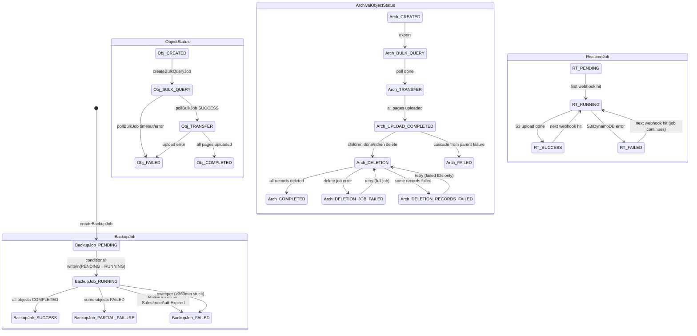
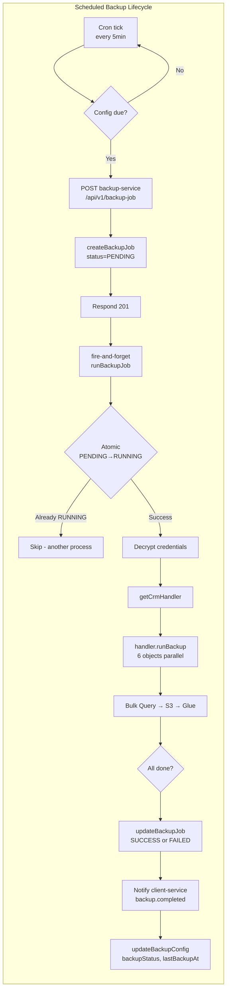
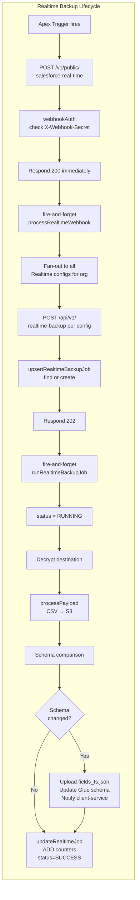

# Execution Flow Graph

```mermaid
stateDiagram-v2
    [*] --> BackupJob_PENDING: createBackupJob

    state BackupJob {
        BackupJob_PENDING --> BackupJob_RUNNING: conditional write\n(PENDING→RUNNING)
        BackupJob_RUNNING --> BackupJob_SUCCESS: all objects COMPLETED
        BackupJob_RUNNING --> BackupJob_PARTIAL_FAILURE: some objects FAILED
        BackupJob_RUNNING --> BackupJob_FAILED: critical error\nor SalesforceAuthExpired
        BackupJob_RUNNING --> BackupJob_FAILED: sweeper (>360min stuck)
    }

    state ObjectStatus {
        Obj_CREATED --> Obj_BULK_QUERY: createBulkQueryJob
        Obj_BULK_QUERY --> Obj_TRANSFER: pollBulkJob SUCCESS
        Obj_BULK_QUERY --> Obj_FAILED: pollBulkJob timeout/error
        Obj_TRANSFER --> Obj_COMPLETED: all pages uploaded
        Obj_TRANSFER --> Obj_FAILED: upload error
    }

    state ArchivalObjectStatus {
        Arch_CREATED --> Arch_BULK_QUERY: export
        Arch_BULK_QUERY --> Arch_TRANSFER: poll done
        Arch_TRANSFER --> Arch_UPLOAD_COMPLETED: all pages uploaded
        Arch_UPLOAD_COMPLETED --> Arch_DELETION: children done\nthen delete
        Arch_DELETION --> Arch_COMPLETED: all records deleted
        Arch_DELETION --> Arch_DELETION_JOB_FAILED: delete job error
        Arch_DELETION --> Arch_DELETION_RECORDS_FAILED: some records failed
        Arch_DELETION_RECORDS_FAILED --> Arch_DELETION: retry (failed IDs only)
        Arch_DELETION_JOB_FAILED --> Arch_DELETION: retry (full job)
        Arch_UPLOAD_COMPLETED --> Arch_FAILED: cascade from parent failure
    }

    state RealtimeJob {
        RT_PENDING --> RT_RUNNING: first webhook hit
        RT_RUNNING --> RT_SUCCESS: S3 upload done
        RT_SUCCESS --> RT_RUNNING: next webhook hit
        RT_RUNNING --> RT_FAILED: S3/DynamoDB error
        RT_FAILED --> RT_RUNNING: next webhook hit (job continues)
    }
```

```mermaid
flowchart LR
    subgraph "Scheduled Backup Lifecycle"
        A[Cron tick\nevery 5min] --> B{Config due?}
        B -->|No| A
        B -->|Yes| C[POST backup-service\n/api/v1/backup-job]
        C --> D[createBackupJob\nstatus=PENDING]
        D --> E[Respond 201]
        E --> F[fire-and-forget\nrunBackupJob]
        F --> G{Atomic\nPENDING→RUNNING}
        G -->|Already RUNNING| H[Skip - another process]
        G -->|Success| I[Decrypt credentials]
        I --> J[getCrmHandler]
        J --> K[handler.runBackup\n6 objects parallel]
        K --> L[Bulk Query → S3 → Glue]
        L --> M{All done?}
        M --> N[updateBackupJob\nSUCCESS or FAILED]
        N --> O[Notify client-service\nbackup.completed]
        O --> P[updateBackupConfig\nbackupStatus, lastBackupAt]
    end
```

```mermaid
flowchart LR
    subgraph "Realtime Backup Lifecycle"
        A[Apex Trigger fires] --> B[POST /v1/public/\nsalesforce-real-time]
        B --> C[webhookAuth\ncheck X-Webhook-Secret]
        C --> D[Respond 200 immediately]
        D --> E[fire-and-forget\nprocessRealtimeWebhook]
        E --> F[Fan-out to all\nRealtime configs for org]
        F --> G[POST /api/v1/\nrealtime-backup per config]
        G --> H[upsertRealtimeBackupJob\nfind or create]
        H --> I[Respond 202]
        I --> J[fire-and-forget\nrunRealtimeBackupJob]
        J --> K[status = RUNNING]
        K --> L[Decrypt destination]
        L --> M[processPayload\nCSV → S3]
        M --> N[Schema comparison]
        N --> O{Schema\nchanged?}
        O -->|Yes| P[Upload fields_ts.json\nUpdate Glue schema\nNotify client-service]
        O -->|No| Q
        P --> Q[updateRealtimeJob\nADD counters\nstatus=SUCCESS]
    end
```
