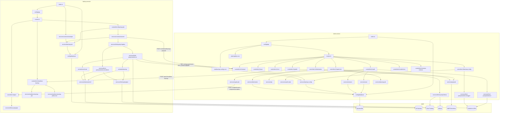

# Module Dependency Graph

```mermaid
graph TD
    subgraph client-service
        CS_INDEX[index.ts] --> CS_APP[config/app]
        CS_INDEX --> CS_DB[config/database]
        CS_APP --> CS_ROUTES[routes/v1]
        CS_APP --> CS_CRON_BC[jobs/backup-config-cron]
        CS_APP --> CS_CRON_N[jobs/nightly-cron]
        CS_ROUTES --> CS_CTRL_AUTH[controller/v1/auth]
        CS_ROUTES --> CS_CTRL_USER[controller/v1/user]
        CS_ROUTES --> CS_CTRL_CRM[controller/v1/crm]
        CS_ROUTES --> CS_CTRL_BC[controller/v1/backup-config]
        CS_ROUTES --> CS_CTRL_DEST[controller/v1/destination]
        CS_ROUTES --> CS_CTRL_INT[controller/v1/internal]
        CS_ROUTES --> CS_CTRL_PUB[controller/v1/public]
        CS_ROUTES --> CS_CTRL_SF[controller/v1/salesforce]
        CS_ROUTES --> CS_CTRL_RR[controller/v1/restore-retrieve]
        CS_ROUTES --> CS_CTRL_SPARK[controller/v1/spark-job]
        CS_CTRL_AUTH --> CS_SVC_USER[services/user]
        CS_CTRL_AUTH --> CS_SVC_SESSION[services/session]
        CS_CTRL_AUTH --> CS_SVC_OTP[services/otp]
        CS_CTRL_AUTH --> CS_SVC_OAUTH[services/oauth-state]
        CS_CTRL_AUTH --> CS_SVC_SF[services/third-party/salesforce]
        CS_CTRL_BC --> CS_SVC_BC[services/backup-config]
        CS_CTRL_BC --> CS_SVC_SF_TRIG[services/third-party/salesforce/trigger]
        CS_CTRL_DEST --> CS_SVC_DEST[services/destination]
        CS_CTRL_DEST --> CS_SVC_ATHENA[services/third-party/athena]
        CS_CTRL_INT --> CS_SVC_BC
        CS_CTRL_PUB --> CS_SVC_EMR[services/payload]
        CS_CTRL_SPARK --> CS_SVC_EMR
        CS_CTRL_SPARK --> CS_SVC_BJ[services/backup-job]
        CS_CTRL_SPARK --> CS_SVC_SPARK[services/spark-job]
        CS_CRON_BC --> CS_SVC_BC
        CS_SVC_USER --> CS_DB
        CS_SVC_SESSION --> CS_DB
        CS_SVC_BC --> CS_DB
        CS_SVC_DEST --> CS_DB
    end

    subgraph backup-service
        BS_INDEX[index.ts] --> BS_APP[config/app]
        BS_INDEX --> BS_DB[config/database]
        BS_INDEX --> BS_SWEEPER[services/common/sweeper]
        BS_APP --> BS_ROUTES[routes/v1]
        BS_ROUTES --> BS_CTRL_BJ[controller/v1/backup-job]
        BS_ROUTES --> BS_CTRL_RT[controller/v1/realtime-backup]
        BS_ROUTES --> BS_CTRL_GLUE[controller/v1/glue]
        BS_CTRL_GLUE --> BS_SVC_GLUE[services/third-party/glue]
        BS_CTRL_BJ --> BS_SVC_BJ[services/backup-job]
        BS_CTRL_BJ --> BS_RUNNER[services/common/runner]
        BS_CTRL_RT --> BS_SVC_RT[services/realtime-backup-job]
        BS_CTRL_RT --> BS_RT_RUNNER[services/realtime-backup-job/runner]
        BS_RUNNER --> BS_SVC_BJ
        BS_RUNNER --> BS_REGISTRY[services/third-party/registry]
        BS_REGISTRY --> BS_SF_HANDLER[services/third-party/salesforce]
        BS_REGISTRY --> BS_RT_HANDLER[services/third-party/salesforce/realtime]
        BS_SF_HANDLER --> BS_SF_BACKUP[schedule/backup]
        BS_SF_HANDLER --> BS_SF_ARCHIVAL[schedule/archival]
        BS_SF_BACKUP --> BS_S3[services/destination/s3]
        BS_SF_BACKUP --> BS_GLUE[services/third-party/glue]
        BS_SF_ARCHIVAL --> BS_S3
        BS_RT_HANDLER --> BS_S3
        BS_RT_HANDLER --> BS_GLUE
        BS_SWEEPER --> BS_SVC_BJ
        BS_SVC_BJ --> BS_DB
    end

    subgraph AWS
        DYNAMO[(DynamoDB)]
        S3_BUCKET[(S3 Buckets)]
        GLUE_CATALOG[(Glue Catalog)]
        ATHENA_SVC[(Athena)]
        EMR_SVC[(EMR Serverless)]
        SF_API[(Salesforce APIs)]
    end

    CS_DB --> DYNAMO
    BS_DB --> DYNAMO
    BS_S3 --> S3_BUCKET
    BS_GLUE --> GLUE_CATALOG
    CS_SVC_ATHENA --> GLUE_CATALOG
    CS_SVC_ATHENA --> ATHENA_SVC
    CS_SVC_EMR --> EMR_SVC
    BS_SF_HANDLER --> SF_API
    CS_SVC_SF --> SF_API
    CS_SVC_SF_TRIG --> SF_API

    CS_CTRL_PUB -->|POST /api/v1/realtime-backup| BS_CTRL_RT
    CS_SVC_SPARK -->|POST /v1/glue/ensure-compression-tables| BS_CTRL_GLUE
    BS_RUNNER -->|POST /v1/internal/backup-payload| CS_CTRL_INT
    BS_SF_HANDLER -->|GET /v1/internal/refresh-token| CS_CTRL_INT
    BS_SF_HANDLER -->|GET /v1/internal/fields| CS_CTRL_INT
```
