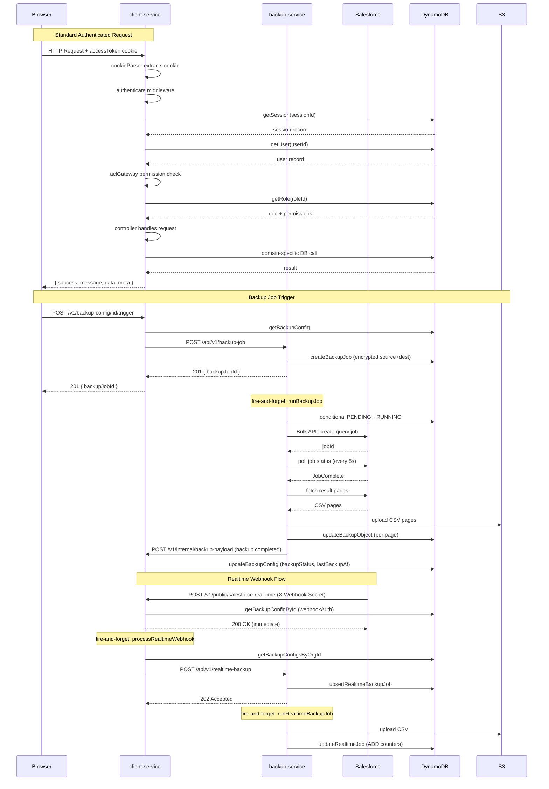

# Request Flow Graph

```mermaid
sequenceDiagram
    participant Browser
    participant CS as client-service
    participant BS as backup-service
    participant SF as Salesforce
    participant DDB as DynamoDB
    participant S3 as S3

    Note over Browser,CS: Standard Authenticated Request
    Browser->>CS: HTTP Request + accessToken cookie
    CS->>CS: cookieParser extracts cookie
    CS->>CS: authenticate middleware
    CS->>DDB: getSession(sessionId)
    DDB-->>CS: session record
    CS->>DDB: getUser(userId)
    DDB-->>CS: user record
    CS->>CS: aclGateway permission check
    CS->>DDB: getRole(roleId)
    DDB-->>CS: role + permissions
    CS->>CS: controller handles request
    CS->>DDB: domain-specific DB call
    DDB-->>CS: result
    CS-->>Browser: { success, message, data, meta }

    Note over Browser,S3: Backup Job Trigger
    Browser->>CS: POST /v1/backup-config/:id/trigger
    CS->>DDB: getBackupConfig
    CS->>BS: POST /api/v1/backup-job
    BS->>DDB: createBackupJob (encrypted source+dest)
    BS-->>CS: 201 { backupJobId }
    CS-->>Browser: 201 { backupJobId }
    Note over BS: fire-and-forget: runBackupJob
    BS->>DDB: conditional PENDING→RUNNING
    BS->>SF: Bulk API: create query job
    SF-->>BS: jobId
    BS->>SF: poll job status (every 5s)
    SF-->>BS: JobComplete
    BS->>SF: fetch result pages
    SF-->>BS: CSV pages
    BS->>S3: upload CSV pages
    BS->>DDB: updateBackupObject (per page)
    BS->>CS: POST /v1/internal/backup-payload (backup.completed)
    CS->>DDB: updateBackupConfig (backupStatus, lastBackupAt)

    Note over SF,CS: Realtime Webhook Flow
    SF->>CS: POST /v1/public/salesforce-real-time (X-Webhook-Secret)
    CS->>DDB: getBackupConfigById (webhookAuth)
    CS-->>SF: 200 OK (immediate)
    Note over CS: fire-and-forget: processRealtimeWebhook
    CS->>DDB: getBackupConfigsByOrgId
    CS->>BS: POST /api/v1/realtime-backup
    BS->>DDB: upsertRealtimeBackupJob
    BS-->>CS: 202 Accepted
    Note over BS: fire-and-forget: runRealtimeBackupJob
    BS->>S3: upload CSV
    BS->>DDB: updateRealtimeJob (ADD counters)
```
