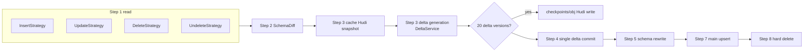

---
tags:
  - architecture
  - java
  - backup
  - pipeline
  - spark
---

# Java Backup Flow — Service, Pipeline, Stages, Readers, Cleanup, Cascade

The heart of the app. Paths relative to
`DataValut-Middleware-App/src/main/java/com/example/`.

## Layer 1 — BackupService.java (280 lines): per-run orchestration

Contract (`backup/service/BackupService.java:33-55`): one **atomic upsert per
object across all Backup Jobs**; result reported at backupConfigId level as a
list of `"ObjectName: reason"` failures; one object's failure never stops the
others.

`run(spark, request, backupJobIds)` (`:72-233`):
1. Build URIs: `scopedBaseUri` + `schemaBaseUri` via PathUtils (`:74-79`,
   [[JAVA_HUDI_STORAGE]]); single driver-side `jobTimestamp` (`:84`).
2. `objectOperations = details.getMergedObjectOperations()` (`:88`).
3. **Parallel dispatch**: ForkJoinPool capped at 20 (`:106-113`); per object:
   - op flags from the merged list (`:118-122`); FAIR pool per object (`:130-132`);
   - build immutable `ProcessingContext` (`:134-147`, defined at
     `backup/strategy/ProcessingContext.java:22-118` — objectName, scopedBase,
     reader, backupType, backupJobIds, apply* flags, jobTimestamp);
   - table names `salesforce_<obj>` / `_delta` via `HudiUtils.toHudiTableName`
     (`:149-150`);
   - `RetryExecutor.executeVoid(OBJECT_PIPELINE, () -> pipeline.run(...))`
     (`:156-160`);
   - REALTIME + deletes → `runCascadeForObject` (`:163-166`, § Cascade below);
   - source cleanup guarded by the `SOURCE_CLEANUP` stage checkpoint
     (`:169-181`), then `objectCheckpoint.clear()` (`:182`);
   - catch ladder → failures list (`:184-201`, see [[JAVA_RETRY]]).
4. **Full-success cleanup**: only when `failures.isEmpty()`, delete each Backup
   Job's whole `raw_data/{jobId}/` folder (`:216-230`,
   `SourceCleaner.deleteBackupJobFolders`). Any object failed ⇒ folders kept
   for retry.

## Layer 2 — BackupPipeline.java (752 lines): per-object unified pipeline

Auto-detects first-run per object: no completed Hudi commit at MAIN_HUDI ⇒
first run (`backup/pipeline/BackupPipeline.java:137-138`, `hudiTableExists
:545-550` → `HudiUtils.tableExists`). Stage overviews in javadoc `:47-84`.
Both paths run under a `StageCheckpoint` for crash-resume — full detail in
[[CHECKPOINT_FLOW]] § A; entry/clear/preserve at `:143-165`.

`ROWS_PER_PARTITION = 1_000_000` (`:89-92`) — the volume-based repartition
knob for the combined main upsert (ponytail-marked calibration).

### First-run path (`runFirstRun` `:172-233`)

In-memory, single-commit design: nothing touches Hudi until Stage 7.
State object: `backup/pipeline/model/InMemoryState.java` — mutable carrier of
`baseDataFrame` (auto-unpersists on replace, `:86-91`), `deltaAccumulator`
(5-col delta frames, `:37-42`), `processedFiles` (S3 paths snapshotted at read
time, `:44-49`), `schemaDiff`/`schemaChangedAt` (`:51-63`).

| Stage | Class | What it does |
|-------|-------|--------------|
| 1 Insert | `stage/InsertProcessor.java:40-69` | snapshot inserts/ file lists per job (`:46-50`), read via InsertStrategy, set base DataFrame |
| 2 Update | `stage/UpdateProcessor.java:54-117` | alignAndUnion base+updates, preCombine keep-latest-LMD per Id (`:91-93`); build UPDATE deltas via window/lag (`buildUpdateDelta :140-300` — one delta per state transition; no-LMD fallback join `:242-293`) |
| 3 Delete | `stage/DeleteProcessor.java:53-111` | broadcast delete-Id set; DELETE deltas carry FULL record JSON (`buildDeleteDelta :113-170`, event time = delete file's LMD `:118-131`); anti-join removes rows (`:102-106`) |
| 4 Undelete | `stage/UndeleteProcessor.java:41-90` | UNDELETE deltas (`buildUndeleteDelta :92-119`), re-insert via alignAndUnion + preCombine |
| 5 SchemaChangeTracker | see [[JAVA_SCHEMA_EVOLUTION]] | schema diff → SCHEMA deltas + nullification |
| 6 FinalSchemaApplicator | see [[JAVA_SCHEMA_EVOLUTION]] | cast base to authoritative schema (all STRING) |
| 7 FirstRunHudiWriter | `stage/FirstRunHudiWriter.java:38-135` | main table: reorder cols for Parquet pushdown, partition by CreatedDate⤳LMD, `bulk_insert + Overwrite`, globalIndex=true (`:64-99`); delta table: key `delta_id`, partition by change_time (`:104-135`). Both guarded by FIRST_RUN_* checkpoints (`BackupPipeline.java:209-221`) |
| 8 FirstRunCleaner | `stage/FirstRunCleaner.java:55-137` | delete ONLY snapshotted files; prune old schema files keeping `fields.json` (`pruneOldSchemaFiles :90-137`); failures throw `CleanupException` so the checkpoint preserves retry |

No base data after stages 1–4 ⇒ skip the rest (`BackupPipeline.java:190-193`).

### Incremental path (`runIncremental` `:239-539`)

1. **Read** all four folders via strategies wrapped in `safeReadStrategy`
   (`:259-271`, `:579-589` — one strategy failure logs and continues).
2. **Schema load + diff** (`:274-296`) — previous schema only when
   `applySchemaChange`; auto-detect dropped columns vs the Hudi schema when no
   previous version exists (`findDroppedHudiColumns :719-751`).
3. **Snapshot cache** (`readAndCacheSnapshot :557-576`) — read Hudi once,
   reused by every delta generator AND the periodic checkpoint.
4. **Delta generation** (`:311-368`) — UPDATE (+schema-deletion), UNDELETE
   (treated as insert-style delta), TYPE-CHANGE, DELETE — all collected into
   `allDeltaFrames`. Algorithms in [[JAVA_DELTA_MODEL]].
5. **Single delta commit** (`:372-397`) — `maybeCheckpoint` BEFORE the write,
   `writeAllDeltas` under HUDI_WRITE retry, `DELTA_WRITE` checkpoint,
   `incrementDeltaVersion` after ([[CHECKPOINT_FLOW]] § B). Snapshot cache
   released `:400`.
6. **Schema rewrite** (`:403-438`) — only if schema changed; single-pass
   `rewriteHudiTable :655-717` (read once → cast/drop/nullify in-memory →
   `bulk_insert + Overwrite`); failure falls back to `allowColumnDrop` on the
   upsert (`:488`).
7. **Merge I+U+UD → main upsert** (`:441-519`) — alignAndUnion, null-Id filter,
   cast to schema, `DISK_ONLY` persist rationale (`:459-466`), partition by
   CreatedDate⤳LMD per-row coalesce, **volume-based repartition**
   (count/1M rows, `:473-482` — why not distinct year/month: a single-month
   100M-row batch would collapse to one task), upsert with
   `globalIndex=true` (guards the mutable-LMD partition fallback, `:499`),
   `MAIN_UPSERT` checkpoint.
8. **Hard delete** (`:522-536`, `writeHardDeletes :591-648`) — broadcast join
   snapshot × delete Ids, upsert with `EmptyHoodieRecordPayload` (`:642-643`),
   `HARD_DELETE` checkpoint.

Nodes: [[JAVA_DELTA_MODEL]] · [[CHECKPOINT_FLOW]] · [[JAVA_SCHEMA_EVOLUTION]] ·
[[JAVA_HUDI_STORAGE]].

## Readers & strategies

- **`reader/DataReader.java`** — interface contract (`:9-21`): return
  `Optional.empty()` for missing/empty paths, never trigger Spark actions,
  stateless. Registered in **`factory/ReaderFactory.java`** (static registry,
  `:16-53`; only CSV today).
- **`reader/CsvReader.java`** (165 lines) — the only implementation. Salesforce
  processing pipeline (`:21-43`): all-STRING read with
  `multiLine/DROPMALFORMED` (`:73-80`); dot→underscore column rename in ONE
  select (Hudi/Parquet illegal dots, `:87-105`); timestamp/date casts for the
  fixed Salesforce column lists (`:52-59`, `:107-130` — CRITICAL for window
  ordering in delta generation); dedupe by (Id, LMD) (`:132-139`);
  `pathExists` requires ≥1 non-directory child (S3A empty-prefix guard,
  `:147-164`).
- **Strategies** `backup/strategy/{Insert,Update,Delete,Undelete}Strategy.java`
  — identical shape: op-flag gate then
  `MultiBackupJobReader.readAll(..., PathUtils::rawData<Op>, tag)`.
  Interface `DataProcessingStrategy.java:27-42`.
- **`util/MultiBackupJobReader.java`** (102 lines) — fans out one operation
  across every Backup Job folder, stamps each row with `backup_job_id`
  (`:80-85`), unions via `SchemaUtils.alignAndUnion` (`:97-99`). The provenance
  column is defined in `util/SalesforceConstants.java:18-24` and flows into
  both main and delta tables (never diffed).

## Source cleanup — util/SourceCleaner.java (282 lines)

Safety contract: only runs after a successful Hudi commit; worst failure =
re-processing (idempotent upserts) (`:16-27`).
- `listFilePaths` `:159-174` — read-time snapshot (files arriving later are
  never deleted).
- `deleteSpecificFiles` `:184-217` — first-run cleaner path; per-file retry
  (S3_READ policy).
- `deleteSourceFiles` `:70-100` — incremental path; per-op folders across all
  jobs; undeletes always attempted (`:92-94`); failures → `CleanupException`
  (`:45-55`) so `SOURCE_CLEANUP` stays un-checkpointed.
- `deleteBackupJobFolders` `:118-146` — recursive folder removal after
  full-run success; non-fatal (returns failed folders).

## Cascade delete — backup/service/CascadeDeleteService.java (262 lines)

Trigger: REALTIME + applyDelete, from `BackupService.runCascadeForObject`
(`BackupService.java:240-279` — reads `childRelationships` from the parent's
schema via `SchemaIO.readChildRelationships`, unions delete-CSV Ids across all
jobs, distinct).

Per relationship (`CascadeDeleteService.java:80-137`): resolve child Hudi/delta
paths, load child snapshot (missing table → skip), broadcast-join lookupCol ==
deleted parent Id, **cache before writing** (COW replaces the parquet a lazy
plan would still reference, `:108-116`), then:
- `isCascadeDelete=true` → **cascadeDelete** `:141-171` — hard delete via
  `EmptyHoodieRecordPayload` + DELETE delta rows.
- `false` → **nullifyLookup** `:175-204` — set the lookup col to null, upsert
  back + DELETE delta rows.
- `writeCascadeDelta` `:208-261` — ⚠ NOTE: uses a **different delta schema**
  than DeltaService (columns `delta_id(uuid), record_id, object_name,
  change_type, change_time, changed_field, old_value, new_value,
  record_last_modified`) and `change_type="DELETE"` for both behaviors. Flagged
  inconsistency with the 5-column delta model in [[JAVA_DELTA_MODEL]].

## See Also
- [[JAVA_DELTA_MODEL]] — the delta generation algorithms invoked in Step 3
- [[JAVA_SCHEMA_EVOLUTION]] — Stages 5/6 + the incremental schema steps
- [[CHECKPOINT_FLOW]] — both checkpoint mechanisms woven through this flow
- [[JAVA_HUDI_STORAGE]] — write options, paths, partitioning
- [[JAVA_RETRY]] — the policies wrapping every step
- [[COMPRESSION]] — Node lifecycle around this run
- [[JAVA_OVERVIEW]]
