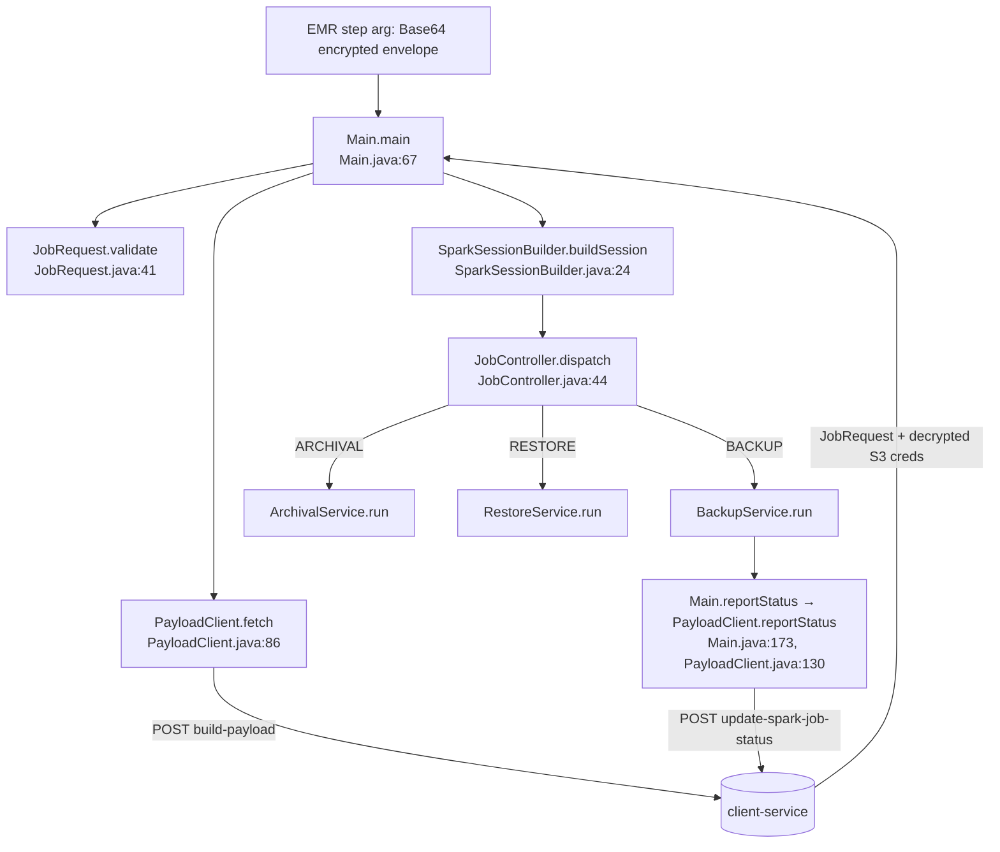

---
tags:
  - architecture
  - java
  - spark
  - hub
---

# Java Middleware (DataValut-Middleware-App) — System Overview

Hub for the Spark/Java compression engine. Written 2026-07-23 from a full read of
`C:\Users\hp\OneDrive\Documents\GitHub\DataValut-Middleware-App\src\main\java\com\example\`
(all 68 files, ~10.7k lines). Every doc in this folder carries `file:line`
pointers into that repo (paths below are relative to `src/main/java/com/example/`).

## What this system is

A single Spark application (fat jar, entry `com.example.Main`) run as an **EMR
Serverless step** by the Node services. One JVM = one job run. It has three job
types, routed by `controller/JobController.java:44-68`:

| jobType | Service | What it does |
|---------|---------|--------------|
| `BACKUP` | `backup/service/BackupService.java` | Compress raw per-job CSV backups into Hudi main + delta (+ periodic checkpoint) tables |
| `ARCHIVAL` | `archival/service/ArchivalService.java` | Flat CSV → Hudi table under the `archival/` prefix |
| `RESTORE` | `restore/service/RestoreService.java` | Phase-1: reconstruct records at a restore point → `restore.csv` |

## End-to-end flow

Nodes: [[JAVA_BOOTSTRAP]] · [[JAVA_BACKUP_FLOW]] · [[JAVA_ARCHIVAL]] ·
[[JAVA_RESTORE]] · [[COMPRESSION]] (the Node-side view of the same round trip).

Only BACKUP reports status back to Node (`Main.java:151-157`); ARCHIVAL and
RESTORE signal failure by throwing (exit code ≠ 0). Exit codes documented at
`Main.java:52-61`: 0 ok · 1 payload error · 2 objects failed · 3 unexpected ·
4 compression ran but status report undeliverable.

## Package map

| Package | Doc | Files |
|---------|-----|-------|
| root + `controller` + `util/PayloadClient,CryptoUtils,JsonUtils` | [[JAVA_BOOTSTRAP]] | Main, SparkSessionBuilder, JobController, PayloadClient, CryptoUtils, JsonUtils |
| `model` | [[JAVA_MODELS]] | JobRequest, JobDetails, EmrRequest, RestoreConfigs, DestinationConfigs, DestinationRequiredCreds, SourceDetails, BackupType, ChildRelationship, SchemaField, SchemaDiff (+2 dead) |
| `retry` | [[JAVA_RETRY]] | RetryExecutor, RetryPolicy, ErrorClassifier, PipelineException, StageCheckpoint |
| `backup/*`, `reader`, `factory`, `util/MultiBackupJobReader,SourceCleaner,SalesforceConstants` | [[JAVA_BACKUP_FLOW]] | BackupService, BackupPipeline, 5 strategies, 8 stage processors, InMemoryState, CsvReader, CascadeDeleteService |
| `backup/service/DeltaService` | [[JAVA_DELTA_MODEL]] | DeltaService (1002 lines — the CDC engine) |
| `service`, `util/SchemaIO,SchemaUtils` + schema stages | [[JAVA_SCHEMA_EVOLUTION]] | SchemaService, SchemaIO, SchemaComparator, DataFrameCaster, SchemaChangeTracker, FinalSchemaApplicator, SchemaUtils |
| `util/HudiUtils,PathUtils`, `resolver` | [[JAVA_HUDI_STORAGE]] | HudiUtils, PathUtils, FolderStructureResolver |
| `archival/*` | [[JAVA_ARCHIVAL]] | ArchivalService, ArchivalPipeline, ArchivalInsertStrategy, ArchivalSchemaApplicator |
| `restore/*` | [[JAVA_RESTORE]] | RestoreService, RestoreReconstructor |
| checkpoints (both kinds) | [[CHECKPOINT_FLOW]] | StageCheckpoint, CheckpointService |

## Core invariants (recur everywhere)

1. **One atomic upsert per object per run** — all Backup Jobs' data for an object
   union into a single Hudi commit (`BackupService.java:36-55`). Never one
   commit per Backup Job.
2. **All columns are STRING** — `parquetDataType` in schema files is metadata
   only; no physical type ever changes (`service/DataFrameCaster.java:21-27`).
3. **Deltas before main** — delta table is written before the main upsert in the
   incremental path, so history is never lost if the main write dies
   (`backup/pipeline/BackupPipeline.java:370-397` vs `:473-516`).
4. **Idempotency everywhere** — Hudi upsert by deterministic keys
   (`Id`, `delta_id = Id|LMD`), stage checkpoints for resume, EAGER rollback of
   inflight commits (`util/HudiUtils.java:241-266`).
5. **Cleanup only after durability** — source CSVs deleted only after the Hudi
   commit; whole Backup Job folders deleted only after ALL objects succeeded
   (`BackupService.java:216-230`, `util/SourceCleaner.java:16-23`).
6. **Java never writes schema files** — Node.js owns `schema/{obj}/fields/`;
   Java is read-only (`util/SchemaIO.java:22-25`).
7. **Node payload is encrypted end-to-end** — AES-256-CBC with per-tenant
   HKDF-derived key; bodies never logged (`util/CryptoUtils.java:16-23`,
   `util/PayloadClient.java:49`).

## Environment variables

| Var | Read at | Purpose |
|-----|---------|---------|
| `NODE_SERVER_URL` | `util/PayloadClient.java:245-250` | Node base URL (fallback `http://localhost:3000`); env var or JVM system property |
| `ENCRYPTION_KEY` | `util/CryptoUtils.java:184-203` | Base64 32-byte AES-256 key; env var or JVM system property; job cannot start without it |

## Concurrency model

- Objects process in parallel, capped at 20, via `ForkJoinPool` +
  `parallelStream` (`BackupService.java:106-114`, same in
  `ArchivalService.java:74-80`). Cap rationale: Hudi timeline-server contention
  on one S3 prefix beyond 20 (`BackupService.java:106-107`).
- Each object gets its own FAIR scheduler pool (`BackupService.java:130-132`,
  `SparkSessionBuilder.java:52-58`).
- RESTORE is sequential (`RestoreService.java:87-94` — Phase-1 deliberate).

## Runnable checks (src/test/java/com/example/)

`JobDetailsTest`, `RetryExecutorTest`, `RetryPolicyTest`, `ErrorClassifierTest`,
`PipelineExceptionTest`, `StageCheckpointTest`, `CheckpointServiceTest`,
`RestoreReconstructorTest`, `CryptoUtilsTest`, `PathUtilsTest`,
`SourceCleanerTest`, `PipelineIntegrationTest`. Python E2E harness in `tests/`
(`spark_runner.py`, `scenarios/`), plus `validate_pipeline.py`-style flows.

## See Also
- [[COMPRESSION]] — Node-side lifecycle wrapping this whole app
- [[CHECKPOINT_FLOW]] — both checkpoint mechanisms in detail
- [[RESTORE_RECORD_RETRIEVAL]] — Node/Athena consumer of the tables this app writes
- [[EXECUTION_PATHS]] — flow index
- [[EXTERNAL_INTEGRATIONS]] · [[SECURITY]] · [[BUSINESS_RULES]]
